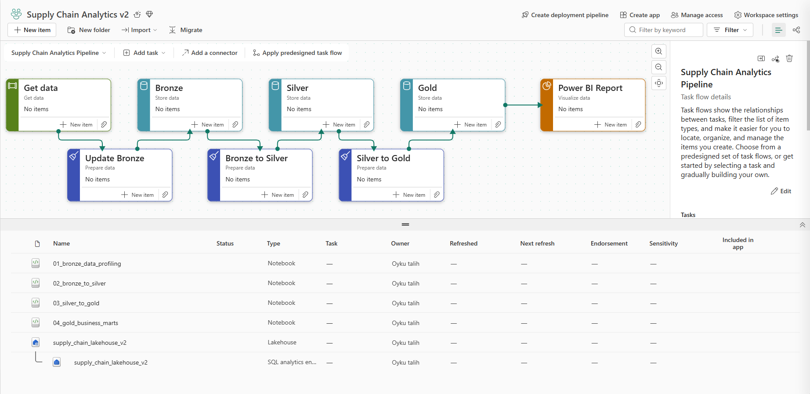
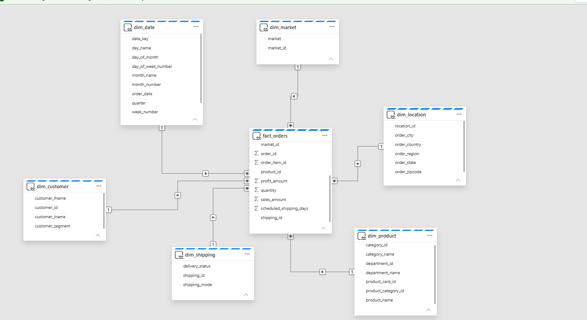
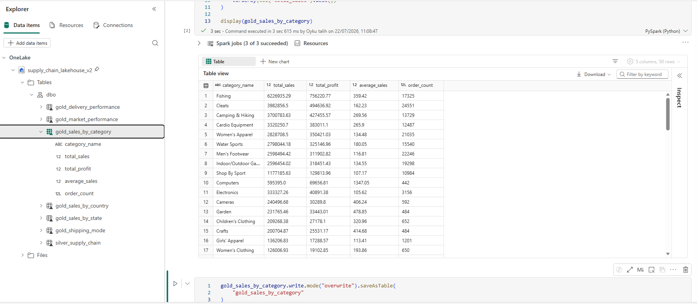

# Supply Chain Analytics Platform using Microsoft Fabric

## 📌 Project Overview

This project demonstrates an end-to-end Supply Chain Analytics solution built using Microsoft Fabric and the DataCo Smart Supply Chain dataset.

The solution follows the Medallion Architecture (Bronze, Silver, Gold) and implements a Star Schema semantic model to transform raw supply chain data into analytics-ready datasets for business reporting and decision-making.

---

## 🛠 Technologies

- Microsoft Fabric
- OneLake
- Lakehouse
- PySpark
- SQL
- Power BI Semantic Model
- Medallion Architecture
- Star Schema
- GitHub

---

## 📂 Project Structure

```text
architecture/
docs/
notebooks/
powerbi/
screenshots/
sql/
```

---

## 🚧 Project Status

- ✅ Workspace & Lakehouse
- ✅ Bronze Layer (Raw Data)
- ✅ Silver Layer (Data Cleaning & Standardization)
- ✅ Gold Layer (Business Marts)
- ✅ Star Schema
- ✅ Direct Lake Semantic Model
- ⏸ Power BI Dashboard (Not included in this project)

---

## 🏗️ Medallion Architecture

### Bronze
- Raw CSV ingestion into Lakehouse

### Silver
- Data cleansing
- Data standardization
- Business-ready detailed dataset

### Gold
Business-oriented aggregated tables:

- gold_delivery_performance
- gold_sales_by_category
- gold_sales_by_country
- gold_sales_by_state
- gold_shipping_mode
- gold_market_performance

---

## ⭐ Star Schema

The analytical model includes the following tables:

### Fact Table
- fact_orders

### Dimension Tables
- dim_customer
- dim_product
- dim_date
- dim_location
- dim_market
- dim_shipping

The semantic model is built using a **Direct Lake Semantic Model** with one-to-many relationships following Star Schema best practices.

---

## 📸 Medallion Architecture



---

## ⭐ Semantic Model



---

## 📊 Gold Layer Example


