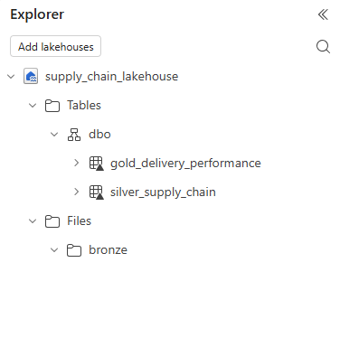
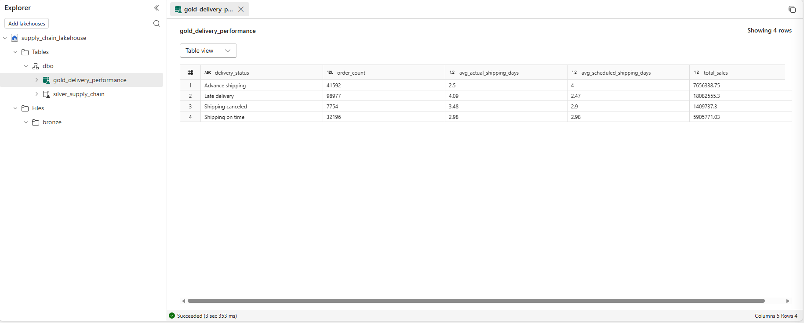

# Supply Chain Analytics Platform using Microsoft Fabric

## 📌 Project Overview

This project demonstrates an end-to-end Supply Chain Analytics solution built using Microsoft Fabric and the DataCo Smart Supply Chain dataset.

The project follows the Medallion Architecture (Bronze, Silver, Gold) to transform raw operational data into business-ready insights.

---

## 🛠 Technologies

- Microsoft Fabric
- Lakehouse
- PySpark
- SQL
- Power BI
- Medallion Architecture
- GitHub

---

## 📂 Project Structure

architecture/
docs/
notebooks/
powerbi/
screenshots/
sql/

---

## 🚧 Project Status

- ✅ Workspace created
- ✅ Lakehouse created
- ✅ Bronze layer completed
- ✅ Silver layer completed
- ✅ Gold layer completed
- ✅ Task Flow documented
- ⏳ Semantic Model
- ⏳ Power BI Dashboard

---

## Architecture

## Lakehouse Structure

## Gold Layer Output

